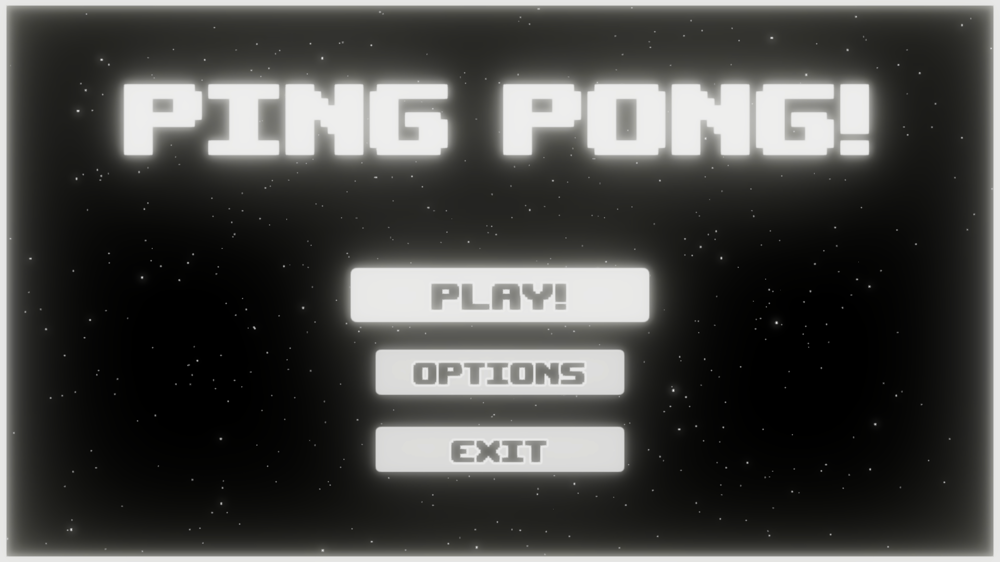
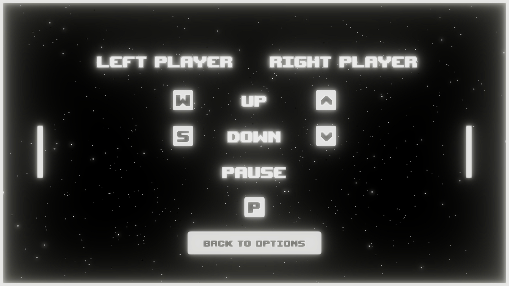
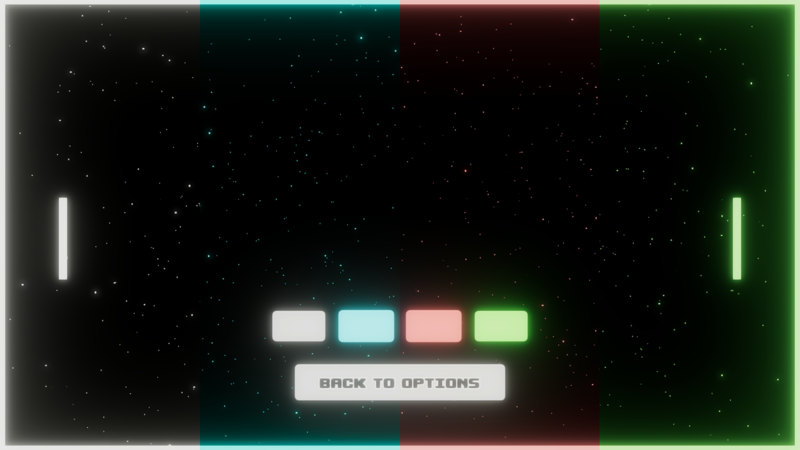
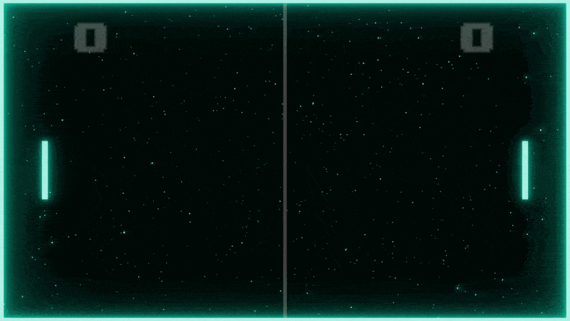

# PING PONG!

**PING PONG!** is a small local multiplayer arcade game inspired by the classic Pong. It was created in **Unity** in **June 2024** as my **first completed game project**.

## Project Overview

This project was created a couple of months into learning Unity, when I was still very early in my game development journey. The core gameplay is simple, but the project also includes menus, persistent settings, visual customization, and a few small gameplay polish elements.

Looking back, it clearly reflects my experience level at the time, but that is also what makes it meaningful to me — it was the first project where I turned a very simple idea into a complete playable result.

## Play

You can download the playable build on [itch.io](https://wojciech-maciejewski.itch.io/ping-pong).

## Gallery

### Main Menu

### Controls

### Color Settings

### Goal Close-up Effect

## Disclaimer

This project is inspired by the original **Pong** and was created for learning and portfolio purposes.
